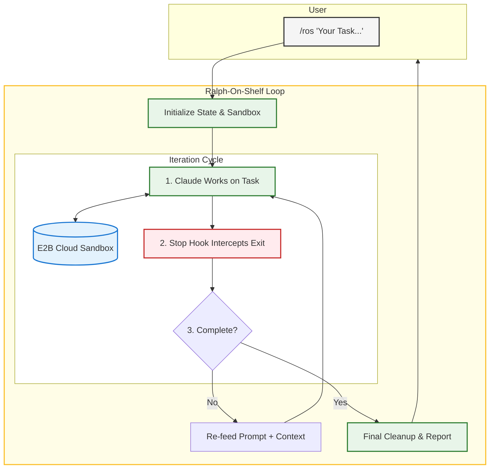

<div align="center">

# Ralph-On-Shelf (ROS)


**Autonomous AI agents running in secure cloud sandboxes**

*"I'm helping!"* — Ralph, probably

[](https://www.python.org/downloads/)
[](https://e2b.dev)
[](https://claude.ai/code)

</div>

---

## What is Ralph-On-Shelf?

ROS is an autonomous agent framework that combines **secure cloud sandboxes** with a **self-referential iteration loop** — allowing AI to work on complex tasks completely autonomously until completion.

Named after the [Ralph Wiggum agentic pattern](https://ghuntley.com/ralph/), Ralph is now sitting on a shelf watching your code execute safely in isolated E2B cloud environments.

### Core Components

| Component | Purpose |
|-----------|---------|
| **E2B Sandboxes** | Isolated cloud VMs with ~150ms startup for safe code execution |
| **Ralph Loop** | Self-referential feedback loop that re-prompts until task completion |
| **Stop Hook** | Intercepts exit attempts and decides whether to continue iterating |
| **State Persistence** | Sandbox files persist between iterations — Ralph reads his own work |

---

## The Ralph Loop: How Autonomous Iteration Works

The Ralph Loop is a self-referential pattern where the AI agent continuously re-prompts itself until a task is complete. Unlike simple retry mechanisms, this creates true autonomous behavior:



### Why This Works

1. **Self-Referential Context**: Each iteration, Claude reads files it created in previous iterations. It's essentially having a conversation with its past self.

2. **Persistent State**: The E2B sandbox maintains all files, installed packages, and state between iterations. Nothing is lost.

3. **Completion Detection**: The loop only exits when Claude outputs a specific completion promise (default: `"COMPLETE"`) or hits the max iteration safety limit.

4. **Incremental Progress**: Complex tasks get broken down naturally. Build the schema in iteration 1, add endpoints in iteration 2, write tests in iteration 3, etc.

---

## Quick Start

### Prerequisites

- Python 3.11+
- Claude Code CLI
- E2B API key ([get one here](https://e2b.dev))

### Installation

```bash
# Clone and install
git clone <repo-url>
cd ClaudeAgentE2B
pip install -e ".[dev]"

# Set up environment
cp .env.example .env
# Add your API keys to .env:
#   ANTHROPIC_API_KEY=sk-ant-...
#   E2B_API_KEY=e2b_...
```

### Usage

```bash
# Start an autonomous loop
/ros "Build a REST API with CRUD operations and tests. Output COMPLETE when done." --max-iterations 20

# Cancel if needed
/cancel-ros
```

---

## Commands

### `/ros <prompt> [options]`

Start an autonomous loop in an E2B sandbox.

```bash
# Basic usage
/ros "Calculate prime numbers up to 1000 and save to primes.txt. Output COMPLETE when done."

# With options
/ros "Build a todo API with tests" --max-iterations 30 --completion-promise "ALL_DONE"
```

**Options:**
| Option | Default | Description |
|--------|---------|-------------|
| `--max-iterations` | 10 | Safety limit - stops after N iterations |
| `--completion-promise` | "COMPLETE" | Text that signals task is done |

### `/cancel-ros`

Cancel an active loop and clean up the sandbox.

```bash
/cancel-ros
```

---

## Writing Good Prompts

### Do: Clear Completion Criteria

```bash
/ros "Build a REST API for todos.

Requirements:
- CRUD endpoints (GET, POST, PUT, DELETE)
- Input validation
- Error handling
- Tests with >80% coverage

Output COMPLETE when all requirements are met." --max-iterations 25
```

### Do: Incremental Goals

```bash
/ros "Build an authentication system in phases:

Phase 1: User model and database schema
Phase 2: Registration endpoint with validation
Phase 3: Login endpoint with JWT tokens
Phase 4: Protected route middleware
Phase 5: Tests for all endpoints

After each phase, verify it works before proceeding.
Output COMPLETE when all phases pass." --max-iterations 40
```

### Don't: Vague Requirements

```bash
# Bad - no clear completion criteria
/ros "Make a good API"

# Bad - no way to verify success
/ros "Optimize the code"
```

---

## State Management

ROS tracks loop state in `.ros-state.json`:

```json
{
  "active": true,
  "prompt": "Your task...",
  "max_iterations": 20,
  "completion_promise": "COMPLETE",
  "current_iteration": 5,
  "sandbox_id": "sbx_abc123",
  "status": "running",
  "started_at": "2025-01-09T10:00:00Z"
}
```

The sandbox persists between iterations, so files created in iteration 1 are available in iteration 2.

---

## Project Structure

```
ClaudeAgentE2B/
├── README.md                           # This file
├── CLAUDE.md                           # Claude Code instructions
├── main.py                             # Direct E2B tool usage
├── pyproject.toml                      # Dependencies
├── .env                                # API keys (not committed)
│
└── .claude-plugins/
    └── ralph-on-shelf/                 # ROS Plugin
        ├── plugin.json                 # Plugin manifest
        ├── README.md                   # Plugin docs
        ├── commands/
        │   ├── ros.md                  # /ros command
        │   └── cancel-ros.md           # /cancel-ros command
        ├── hooks/
        │   ├── stop.md                 # Hook documentation
        │   └── stop.py                 # Stop hook implementation
        ├── agents/
        │   └── sandbox-executor.md     # Agent definition
        └── lib/
            ├── __init__.py
            └── sandbox_manager.py      # E2B utilities
```

---

## Environment Variables

```bash
# .env
ANTHROPIC_API_KEY=sk-ant-...    # Claude API key
E2B_API_KEY=e2b_...             # E2B sandbox API key
```

---

## Roadmap

- [x] E2B sandbox integration
- [x] Basic ROS loop with Stop hook
- [x] `/ros` and `/cancel-ros` commands
- [ ] **Ralph Orchestrator** - Launch multiple sandboxes in parallel
- [ ] Sandbox templates - Pre-configured environments (ML, web dev, data science)
- [ ] Progress streaming - Real-time output from sandbox
- [ ] Checkpoint/resume - Save state across sessions
- [ ] Cost tracking - Monitor API and sandbox usage

---

## Inspiration

- [Ralph Wiggum Pattern](https://ghuntley.com/ralph/) - The original self-referential loop technique
- [Ralph Orchestrator](https://github.com/mikeyobrien/ralph-orchestrator) - Multi-agent orchestration
- [E2B](https://e2b.dev) - Secure sandbox infrastructure

---

## License

MIT License - See LICENSE file for details.
